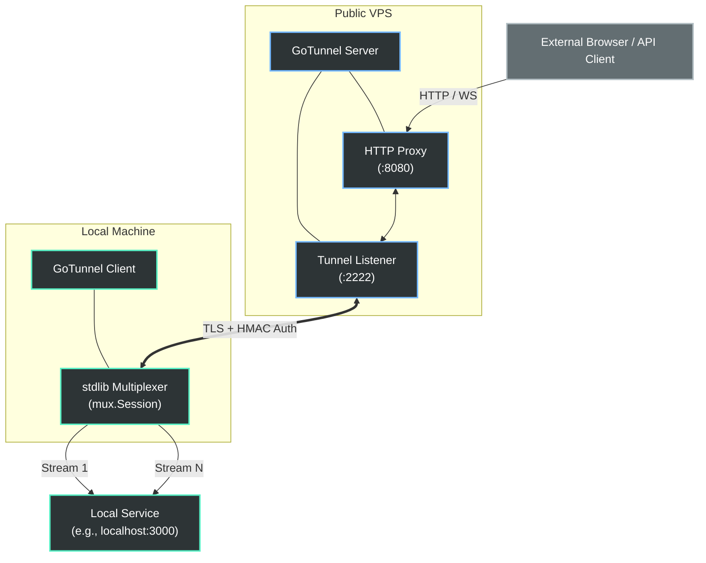

# GoTunnel

> A self-hosted, zero-dependency reverse tunnel written in Go. Securely expose local HTTP, WebSocket, or TCP services to the public internet via a remote server without relying on third-party services.

[](https://golang.org/)
[](LICENSE)
[]()

## Table of Contents
- [Overview](#overview)
- [Key Features](#key-features)
- [Architecture](#architecture)
- [Getting Started](#getting-started)
- [Configuration Reference](#configuration-reference)
- [Web Dashboard & Traffic Inspector](#web-dashboard--traffic-inspector)
- [Advanced Usage](#advanced-usage)

---

## Overview

GoTunnel provides a robust infrastructure to expose internal services securely. It operates using a single executable and configuration file, allowing developers to establish multiplexed, TLS-encrypted tunnels between a local machine and a public-facing Virtual Private Server (VPS).

---

## Key Features

- **Interactive Setup Wizard:** Automatically launches a web-based configuration builder on first run if no `config.yaml` is present.
- **Zero-Flag Execution:** Configuration is strictly managed via a declarative `config.yaml`.
- **Multiplexed Concurrency:** Define and run any number of tunnels simultaneously within a single process.
- **Protocol Agnostic:** Seamlessly routes HTTP, WebSockets, and raw TCP traffic.
- **Subdomain Routing (HTTP):** Map multiple HTTP services to distinct subdomains on a single public endpoint.
- **Terminal User Interface (TUI):** Real-time traffic monitoring, state inspection, and structured HTTP event logging (Method, Path, Status, Duration) natively in the terminal.
- **Headless Daemon:** Automatically detaches to the background. Persistent tunnels remain active, allowing you to reattach the TUI session at any time.
- **Web Dashboard:** Embedded, protected web application at `localhost:4040` for live metrics, granular request inspection, and one-click request replays.
- **Enterprise-Grade Security:**
  - HMAC-SHA256 challenge/response authentication.
  - End-to-end TLS encryption on the tunnel layer.
  - Granular access controls including per-tunnel API keys and HTTP Basic Authentication.
  - Built-in brute-force protection.
- **Zero External Dependencies:** Built entirely on the Go standard library (aside from YAML parsing and terminal handling), including a custom-built stream multiplexer.

---

## Architecture

GoTunnel establishes a secure control channel and multiplexes subsequent streams over a single TCP connection.



### Core Components
1. **Authentication Layer:** Clients connect to the tunnel port and perform an HMAC-SHA256 challenge/response. Invalid tokens are rejected and rate-limited.
2. **Stream Multiplexing (`internal/mux`):** A single authenticated TCP connection is promoted to a full-duplex multiplexed session. The engine provides bidirectional streams with independent flow control (256 KB window), graceful teardowns (FIN/RST), and keepalive mechanics.
3. **Traffic Proxying:** For HTTP/WS, the server opens a new stream for each incoming request, forwards it to the client, and streams the response back. For raw TCP, a dedicated listener pipes bytes bidirectionally to the configured target.
4. **Daemon & IPC:** The executable automatically runs as a background daemon. The CLI frontend utilizes local IPC to render the Terminal UI without interrupting active connections.

---

## Getting Started

### Installation

```bash
git clone https://github.com/RGPtv/gotunnel.git
cd gotunnel
go build -o gotunnel ./cmd/gotunnel
```

### Interactive Setup Wizard

If you run `./gotunnel` without an existing `config.yaml` file, it will automatically launch an interactive, web-based Setup Wizard. This wizard will guide you through generating the correct configuration for either Server or Client mode.

Alternatively, you can manually create the configuration files as described below.

### 1. Server Configuration (VPS)

Create `config.yaml` in your working directory on the public server:

```yaml
serverConfig:
  http:    ":8080"
  tun:     ":2222"
  token:   "auto"    # Auto-generates a secure 256-bit token
  inspect: ":4040"
```

Execute the binary:

```bash
./gotunnel
```
> [!NOTE]
> Ensure your firewall rules allow inbound traffic on both the HTTP port (`8080`) and the Tunnel port (`2222`).

### 2. Client Configuration (Local Machine)

Create `config.yaml` on the machine hosting your local services:

```yaml
clientConfig:
  server: "vps.example.com:2222"
  token:  "YOUR_SECRET_TOKEN"
  skipTLSVerify: true   # Required if the server utilizes a self-signed certificate

  tunnels:
    - name:    "web-app"
      target:  "localhost:3000"
      type:    "http"
```

Execute the binary:

```bash
./gotunnel
```
Your local service is now accessible publicly at `http://vps.example.com:8080`.

---

## Configuration Reference

GoTunnel relies on a single `config.yaml` containing either a `serverConfig` or `clientConfig` block.

### Server (`serverConfig`)

| Directive | Default | Description |
|-----------|---------|-------------|
| `http` | `:8080` | Public HTTP proxy address. |
| `https` | *(disabled)* | Public HTTPS proxy address. Requires `cert` and `key`. |
| `tun` | `:2222` | Tunnel listener address for incoming client connections. |
| `token` | `""` | Shared authentication secret. Set to `"auto"` to generate automatically. |
| `cert` | *(auto)* | Absolute path to the TLS certificate PEM file. |
| `key` | *(auto)* | Absolute path to the TLS private key PEM file. |
| `auth` | *(disabled)* | Global HTTP Basic Auth for all proxy traffic (format: `user:pass`). |
| `domain` | *(disabled)* | Base domain for routing subdomains (e.g., `example.com`). |
| `inspect` | `:4040` | Local Web Dashboard binding. Omit to disable. |
| `inspectUser` | `admin` | Username for dashboard authentication. |
| `inspectPass` | *(auto)* | Password for dashboard authentication. Auto-generated and stored in `.gotunnel-admin`. |
| `noTLS` | `false` | Disables TLS on the tunnel layer. **Only use behind a TLS-terminating reverse proxy.** |
| `poolSize` | `512` | Maximum idle connections allowed per tunnel pool. |
| `allowedTCPPorts`| *(optional)* | Restricts the remote ports TCP tunnels are permitted to bind to (e.g. `[":22222"]`). |

### Client (`clientConfig`)

| Directive | Default | Description |
|-----------|---------|-------------|
| `server` | *(required)* | Remote server address (e.g., `host:port` or `https://host[:port]`). |
| `token` | *(required)* | Authentication token matching the server configuration. |
| `skipTLSVerify` | `false` | Bypasses TLS certificate validation. |
| `noTLS` | `false` | Utilizes plain TCP for the tunnel connection. |
| `tunnels` | *(required)* | Array of tunnel definitions (see below). |

#### Tunnel Definitions (`tunnels`)

| Directive | Default | Description |
|-----------|---------|-------------|
| `name` | *(optional)* | Human-readable identifier displayed in logs. |
| `target` | *(required)* | Local address and port to route traffic to (e.g., `localhost:3000`). |
| `type` | `http` | Specifies the proxy protocol (`http` or `tcp`). |
| `subdomain` | *(optional)* | **HTTP tunnels only.** Requests a specific subdomain from the server (e.g., `"api"` → `api.example.com`). Requires the server `domain` parameter. |
| `remote` | *(required for TCP)* | **TCP tunnels only.** Specifies the port to bind on the server (e.g., `:22222`). |

---

## Web Dashboard & Traffic Inspector

The embedded web interface provides powerful administrative and diagnostic capabilities. Navigate to `http://127.0.0.1:4040` on the server machine to access it.

> [!IMPORTANT]
> The default username is `admin`. If `inspectPass` is not explicitly declared, the system automatically generates a password on startup and secures it in a `.gotunnel-admin` file.

- **Overview Dashboard:** Monitor request volume, active connections, and dynamic allocations in real-time.
- **Access Control Management:** Dynamically toggle API Key requirements, Basic Authentication, or AI-specific optimizations (CORS overrides, payload cap removal) on a per-tunnel basis.
- **Traffic Inspector:** Intercept, search, and analyze raw HTTP request/response lifecycles, complete with header and payload visibility.
- **Replay Mechanism:** Re-dispatch intercepted requests directly to the target environment with a single click.

---

## Advanced Usage

### Subdomain Routing (HTTP)
Serve multiple disparate HTTP services from a unified server utilizing subdomains.

> [!NOTE]
> Subdomain routing is supported for **HTTP tunnels only**. TCP tunnels always bind to a dedicated port on the server.

**Server (`config.yaml`):**
```yaml
serverConfig:
  http:   ":8080"
  tun:    ":2222"
  token:  "YOUR_TOKEN"
  domain: "example.com"
```

**Client (`config.yaml`):**
```yaml
clientConfig:
  server: "vps.example.com:2222"
  token:  "YOUR_TOKEN"
  skipTLSVerify: true

  tunnels:
    - name:      "api-service"
      target:    "localhost:3000"
      type:      "http"
      subdomain: "api"       # Routes to api.example.com:8080
    - name:      "documentation"
      target:    "localhost:4000"
      type:      "http"
      subdomain: "docs"      # Routes to docs.example.com:8080
```

### TCP Port Forwarding (SSH, Database Connections)
```yaml
clientConfig:
  server: "vps.example.com:2222"
  token:  "YOUR_TOKEN"
  skipTLSVerify: true

  tunnels:
    - name:   "secure-shell"
      target: "localhost:22"
      type:   "tcp"
      remote: ":22222"
```
Initiate a remote connection via: `ssh user@vps.example.com -p 22222`

### Native HTTPS (Let's Encrypt)
1. Obtain certificates using Certbot:
```bash
# Standard domain
sudo certbot certonly --standalone -d example.com

# Wildcard for subdomain routing
sudo certbot certonly --manual --preferred-challenges dns -d example.com -d "*.example.com"
```
2. Configure your `serverConfig` (`config.yaml`):
```yaml
serverConfig:
  http:   ":80"
  https:  ":443"
  tun:    ":2222"
  token:  "YOUR_TOKEN"
  domain: "example.com"
  cert:   "/etc/letsencrypt/live/example.com/fullchain.pem"
  key:    "/etc/letsencrypt/live/example.com/privkey.pem"
```

### Deployment Behind a Reverse Proxy (NGINX / Cloudflare)
To integrate with an existing TLS-terminating proxy, offload encryption to the proxy layer by setting `noTLS: true`:

**Server (`config.yaml`):**
```yaml
serverConfig:
  http:  ":8080"
  tun:   ":4444"
  token: "YOUR_TOKEN"
  noTLS: true
```

**Client (`config.yaml`):**
```yaml
clientConfig:
  server: "https://tunnel.example.com"
  token:  "YOUR_TOKEN"
  noTLS:  false   # The proxy handles valid TLS presentation
```
